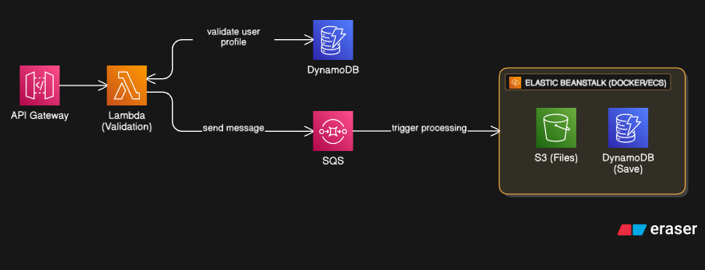

# hack4me

## Overview

**hack4me** is a cloud-native project designed to process and store data efficiently using a serverless architecture on AWS. The workflow leverages several AWS services—API Gateway, Lambda, DynamoDB, SQS, S3, and Elastic Beanstalk—to ensure scalability, reliability, and maintainability.

## How It Works

The core flow of the system is as follows (see architecture diagram above):

1. **API Gateway**
    - Acts as the public entry point for client requests (REST API).
    - Receives incoming HTTP requests from users or external systems.

2. **Lambda (Validation)**
    - The API Gateway triggers a Lambda function responsible for initial validation of the request.
    - The Lambda function:
        - Validates the user profile by querying DynamoDB.
        - If validation passes, sends a message to an SQS queue for asynchronous processing.

3. **DynamoDB (Validation)**
    - Stores user profiles and other relevant metadata.
    - Used during the Lambda validation phase to ensure incoming requests are from authorized users.

4. **SQS (Simple Queue Service)**
    - Acts as a buffer to decouple validation logic from downstream processing.
    - Receives validated messages from Lambda, holding them until the processing service is ready.

5. **Elastic Beanstalk (Dockerized Service)**
    - Hosts a processing application (running in Docker containers).
    - Pulls messages from SQS and triggers the actual data processing logic.
    - Interacts with two main storage services:
        - **S3:** Used to store processed files and data artifacts.
        - **DynamoDB:** Used to save processed data and metadata.

## Technologies Used

- **Python**: Main language for Lambda functions and backend processing.
- **HTML**: Used in frontend or documentation.
- **Docker**: Containerizes services for deployment to Elastic Beanstalk.
- **AWS API Gateway**: RESTful API management.
- **AWS Lambda**: Serverless compute for lightweight logic.
- **AWS DynamoDB**: NoSQL database for user profiles and data.
- **AWS SQS**: Message queuing for decoupled, reliable processing.
- **AWS S3**: Object storage for files.
- **AWS Elastic Beanstalk**: Managed service for deploying Dockerized applications.

## Key Features

- **Serverless validation**: Scalable and cost-effective request validation.
- **Asynchronous processing**: SQS decouples validation from heavy processing.
- **Scalable backend**: Elastic Beanstalk auto-scales the processing service.
- **Reliable storage**: Data and files are safely stored in DynamoDB and S3.
- **Clear separation of concerns**: Each AWS component has a well-defined responsibility.

## Getting Started

1. **Prerequisites**
    - AWS account with access to API Gateway, Lambda, DynamoDB, SQS, S3, and Elastic Beanstalk.
    - Docker installed locally for building images.
    - Python 3.x environment.

2. **Deployment Steps**
    - Deploy the DynamoDB tables and S3 buckets as required.
    - Set up Lambda function and API Gateway integration.
    - Configure SQS for message queuing.
    - Build the Docker image for the processing service and deploy to Elastic Beanstalk.

3. **Configuration**
    - Environment variables and AWS credentials should be set up for each service.
    - IAM roles and permissions must be configured to allow services to communicate securely.

## Diagram

See above for a high-level architecture diagram of the system.

---

*This README was generated with reference to the workflow diagram provided.*

